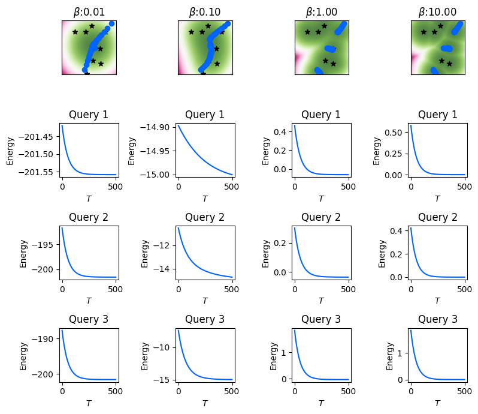
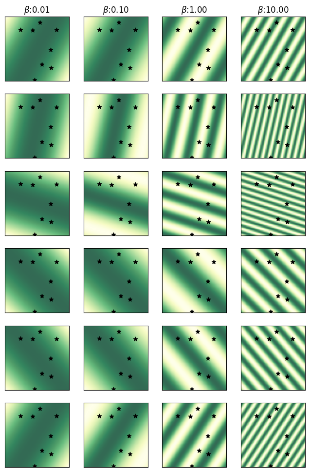
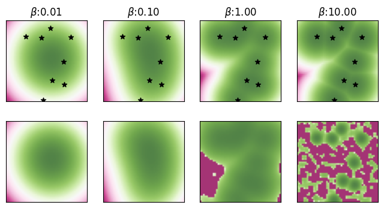
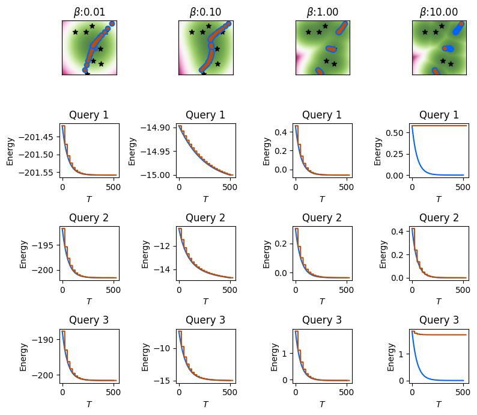
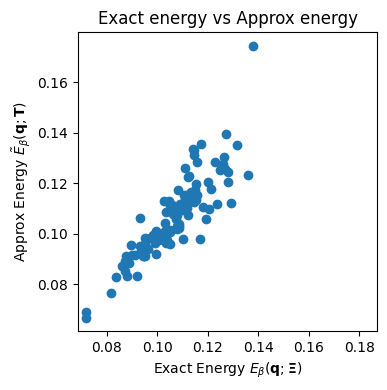

# Distributed Memory


<!-- WARNING: THIS FILE WAS AUTOGENERATED! DO NOT EDIT! -->

<a target="_blank" href="https://colab.research.google.com/github/bhoov/amtutorial/blob/main/tutorial_ipynbs/03_distributed_memory.ipynb">

</a>

In this notebook, we demonstrate how we utilize random features to
disentangle the size of the Dense Associative Memory network from the
number of memories to be stored. Given the standard log-sum-exp energy
*E*<sub>*β*</sub>(⋅; **Ξ**), corresponding to a model
*f*<sub>**Ξ**</sub> of size *O*(*D**K*), we demonstrate how we can use
the trigonometric random features to develop an approximate energy
*Ẽ*<sub>*β*</sub>(⋅; **T**) using a distributed representation **T** of
the memories **Ξ** = {**ξ**<sup>*μ*</sup>, *μ* ∈ \[ \[*K*\] \]}, thus
giving us a model *f*<sub>**T**</sub> of size *O*(*Y*).

For further details on this work, please see \[1\].

## Exact Energy Function

Consider a set of memories
**Ξ** = {**ξ**<sup>1</sup>, …, **ξ**<sup>*K*</sup>} where each memory
**ξ**<sup>*μ*</sup> ∈ ℝ<sup>*D*</sup> is a vector in a *D*-dimensional
Euclidean space. For a state vector **v** ∈ ℝ<sup>*D*</sup>, the
commonly used *log-sum-exp* energy is given by
<span id="eq-l2-lse-energy">
$$
E\_\beta( \mathbf{v}; \boldsymbol{\Xi} ) = - \frac{1}{\beta} \log \sum\_{\mu = 1}^K \exp \left(- \frac{\beta}{2} \left\Vert \mathbf{v} - \boldsymbol{\xi}^\mu \right \Vert^2 \right),
 \qquad(1)$$
</span>

where *β* \> 0 is the *inverse-temperature* controlling the sharpness of
the energy near the memories, with larger values of *β* implying sharper
energy landscapes, while smaller values induce smoother ones.

We can implement this energy function as follows

``` python
def lse_energy(
    state: Float[Array, "D"],
    memories: Float[Array, "K D"],
    beta: float
) -> Float[Array, ""]:
    """
    Compute the standard log-sum-exp energy
    using the negative square Euclidean distance
    as the similarity
    """
    return -(1 / beta) * jax.nn.logsumexp(
        -beta / 2 * ((state - memories) ** 2).sum(-1),
        axis=0
    )
```

### Visualizing the Energy in 2D

First we randomly generate *K* = 8 memories
**Ξ** = {**ξ**<sup>*μ*</sup>, *μ* = 1, …, 8} in *D* = 2 dimensions.

``` python
# Randomly generate memories in 
# the selected domain
rngidx = 0
D = 2
K = 8
Xi = jr.uniform(
    rnglist[rngidx], (K, D)
) * 2 * maxabs - maxabs
```

Given this set **Ξ** of memories, we compute and visualize the 2D energy
landscape defined by
<a href="#eq-l2-lse-energy" class="quarto-xref">Equation 1</a> for
varying values of the inverse-temperature
*β* ∈ {10<sup>−2</sup>, 10<sup>−1</sup>, 1, 10}. We also highlight the
*K* = 8 memories on these landscapes with the **⋆** symbol. We will also
cache the energy landscapes for future visualizations.

<details class="code-fold">
<summary>Computing and visualizing the 2D energy landscape.</summary>

``` python
betas = [0.01, 0.1, 1, 10]
figscaler = 2
fig, axs = plt.subplots(
    1, len(betas), figsize=(
        len(betas) * figscaler, 
        figscaler
    ),
    sharex=True, sharey=True
)
beta_en_cache = {}
for b, ax in tqdm(
    zip(betas, axs), total=len(betas),
    colour=TQDMCOLOR, ncols=50
):
    en = np.zeros_like(V[0])
    for i, j in product(
        range(nsteps),
        range(nsteps)
    ):
        en[i,j] = lse_energy(
            V[:, i, j], Xi, b
        )
    beta_en_cache[b] = en
    plot_energy_landscape(
        en, ax, np.array([
            xmin, xmax, ymin, ymax
        ])
    )
    plot_states(
        Xi, ax, marker='*', color=MCOLOR
    )
    ax.set_title(
        r"$\beta$" + f":{b:0.2f}"
    )
plt.show()
```

</details>

    100%|███████████████| 4/4 [00:04<00:00,  1.09s/it]


### Minimizing the Energy via Gradient Descent

For an initial state vector **q** ∈ ℝ<sup>*D*</sup>, we can minimize its
energy utilizing the energy gradient. Initializing the energy descent at
the **q**, that is **v**<sup>(0)</sup> ← **q**, we perform the following
gradient descent steps for *T* iterations:
**v**<sup>(*t*)</sup> ← **v**<sup>(*t* − 1)</sup> − *α*∇<sub>**v**</sub>*E*<sub>*β*</sub>(**v**<sup>(*t* − 1)</sup>; **Ξ**),
for *t* = 1, …, *T* with *α* \> 0 as the step-size (or learning rate)
for the energy descent. The final **v**<sup>(*T*)</sup> is the output of
the model.

We can implement this using auto-differentiation in JAX by computing the
gradient of the `lse_energy` function with respect to its input `state`.

``` python
def lse_energy_descent( 
    q: Float[Array, "D"],
    memories: Float[Array, "K D"],
    beta,
    energy_fn,
    depth: int=10,
    alpha: float = 0.01,
    return_grads=False,
    clamp_idxs: Optional[Bool[Array, "D"]]=None
) -> Float[Array, "D"]: 
    """
    Energy descent with the LSE energy
    """
    dEdxf = jax.jit(
        jax.value_and_grad(energy_fn)
    )
    logs = {}
    def step(x, i):
        E, dEdx = dEdxf(x, memories, beta)
        if clamp_idxs is not None:
            dEdx = jnp.where(clamp_idxs, 0, dEdx)
        x = x - alpha * dEdx
        aux = (E, dEdx) if return_grads else (E,)
        return x, aux
    x, aux = jax.lax.scan(
        step, q, jnp.arange(depth)
    )
    logs['energies'] = aux[0]
    if return_grads:
        logs['grads'] = aux[1]
    return x, logs
```

#### Energy Descent with the LSE Energy

As an example, we will use the previous set of memories to perform the
energy descent for a randomly generated query **q** ∈ ℝ<sup>*D*</sup>
using the above function `lse_energy_descent`. We will note the
intermediate states **v**<sup>(0)</sup>, …, **v**<sup>(*T*)</sup>, and
the energy
*E*<sub>*β*</sub>(**v**<sup>(*t*)</sup>; **Ξ**), *t* ∈ \[ \[*T*\] \] at
each layer of the DenseAM (equivalently, the energy at each iteration of
the energy gradient descent).

In the following example, the number of DenseAM layers (equivalently,
the number of energy descent steps) is set at *T* = 1000, and we use a
step-size *α* = 0.01. We will plot the intermediate states at every
`NUPDATES=25` layers. We show results for three randomly generated
queries, where the first row of the plot visualizes their intermediate
states of these three queries during the energy descent with the
$\textcolor{blue}{\bullet}$ symbol, while the next three rows visualize
their respective energy descent through the *T* DenseAM layers. We will
cache the intermediate states and energies of the exact energy descent
for future visualizations.

<details class="code-fold">
<summary>Performing and visualizing the energy-descent for three
randomly generated queries (initial states).</summary>

``` python
NSTATES = 20
NUPDATES = 25
NQUERIES = 3
ALPHA = 0.01
rngidx = 8
fig, axs = plt.subplots(
    NQUERIES+1, len(betas), figsize=(
        len(betas) * figscaler, 
        NQUERIES+2 * figscaler
    ),
    sharex="row",
)
beta_true_states_en_cache = {}
for bidx, b in tqdm(
    enumerate(betas), total=len(betas),
    colour=TQDMCOLOR, ncols=50
):
    plot_energy_landscape(
        beta_en_cache[b], axs[0, bidx],
        np.array([xmin, xmax, ymin, ymax])
    )
    plot_states(
        Xi, axs[0, bidx],
        marker='*', color=MCOLOR
    )
    axs[0, bidx].set_title(
        r"$\beta$" + f":{b:0.2f}"
    )
    # Randomly generating queries
    queries = jr.uniform(
        rnglist[rngidx], (NQUERIES, D)
    ) * 2 * maxabs - maxabs
    beta_cache = []
    for qidx, query in enumerate(queries):
        qstates = [query]
        qens = []
        # Perform energy descent
        for i in range(NSTATES):
            query, logs = lse_energy_descent(
                query, Xi, b, lse_energy,
                depth=NUPDATES, alpha=ALPHA
            )
            qstates += [query]
            qens += [logs['energies']]
        qstates = np.array(qstates)
        plot_states(
            qstates, axs[0, bidx],
            marker='o', color=QCOLOR
        )
        qens = np.array(qens).reshape(-1)
        plot_energy_descent(
            qens, axs[qidx+1, bidx],
            color=QCOLOR
        )
        axs[qidx+1, bidx].set_title(
            f"Query {qidx+1}"
        )
        beta_cache += [(qstates, qens)]
    beta_true_states_en_cache[b] = beta_cache
fig.tight_layout()
plt.show()
```

</details>

    100%|███████████████| 4/4 [00:11<00:00,  2.80s/it]



## Viewing Energy as a Kernel Sum

It is easy to see that the aforemention energy function
<a href="#eq-l2-lse-energy" class="quarto-xref">Equation 1</a> can be
viewed as a *kernel sum*. Specifying a kernel function
*κ* : ℝ<sup>*D*</sup> × ℝ<sup>*D*</sup> → ℝ such that
$\kappa(\mathbf{x}, \mathbf{x}') = \exp(-\frac{1}{2} \Vert \mathbf{x} - \mathbf{x}' \Vert^2 )$,
the *radial basis function* or RBF kernel, we can reduce the energy
function to a kernel sum as follows:

In general, we need to keep around all the memories
**Ξ** = {**ξ**<sup>*μ*</sup> ∈ ℝ<sup>*D*</sup>, *μ* ∈ \[ \[*K*\] \]} to
compute this kernel sum, and thus the energy function.

### Simplifying the Kernel Sum with Random Features

However, if there exists a feature map
*Φ* : ℝ<sup>*D*</sup> → ℝ<sup>*Y*</sup>, such that, the dot-product in
this feature space approximates the kernel function as follows:

*κ*(**x**, **x**′) ≈ ⟨*Φ*(**x**), *Φ*(**x**′)⟩,

then the kernel sum can be simplified as (dropping the *β* for now)

In this case, we need to compute the vector – *the distributed memories*
– **T** ∈ ℝ<sup>*Y*</sup> using all the *K* memories
{**ξ**<sup>*μ*</sup>, *μ* ∈ \[ \[*K*\] \]} **just once**, and then use
**T** for all subsequent kernel sum approximation without needing access
to the original memories. Bringing the inverse-temperature *β* into
this, we would instead need to utilize $\Phi(\sqrt{\beta}\mathbf{v})$,
and compute the distributed memories as
$\mathbf{T} = \sum\_\mu \Phi(\sqrt{\beta} \boldsymbol{\xi}^\mu)$.

### Examples of Random Features

Various approximate feature maps have been developed for the RBF kernel.
The first feature map proposed by \[2\] utilizes random features and
trigonometric function. More recently, \[3\] have proposed positive
random features utilizing the exponential function. Both these random
features are presented below, where
**ω**<sup>*i*</sup> ∼ 𝒩(0, **I**<sub>*D*</sub>), *i* ∈ \[ \[*Y*\] \] and
𝒩(0, **I**<sub>*D*</sub>) is the *D*-dimensional multivariate isotropic
standard normal distribution:

$$
\Phi(\mathbf{x}) = \frac{1}{\sqrt{Y}} \left\[ \begin{array}{c}
  \cos \langle \boldsymbol{\omega}^1, \mathbf{x} \rangle \\
  \sin \langle \boldsymbol{\omega}^1, \mathbf{x} \rangle \\
  \cos \langle \boldsymbol{\omega}^2, \mathbf{x} \rangle \\
  \sin \langle \boldsymbol{\omega}^2, \mathbf{x} \rangle \\
  \cdots \\
  \cos \langle \boldsymbol{\omega}^Y, \mathbf{x} \rangle \\
  \sin \langle \boldsymbol{\omega}^Y, \mathbf{x} \rangle \\
\end{array}\right\], 
\qquad 
\Phi(\mathbf{x}) = \frac{\exp(- \left\Vert \mathbf{x} \right\Vert^2)}{\sqrt{2Y}} \left\[ \begin{array}{c}
  \exp (+\langle \boldsymbol{\omega}^1, \mathbf{x} \rangle) \\
  \exp (-\langle \boldsymbol{\omega}^1, \mathbf{x} \rangle) \\
  \exp (+\langle \boldsymbol{\omega}^2, \mathbf{x} \rangle) \\
  \exp (-\langle \boldsymbol{\omega}^2, \mathbf{x} \rangle) \\
  \cdots \\
  \exp (+\langle \boldsymbol{\omega}^Y, \mathbf{x} \rangle) \\
  \exp (-\langle \boldsymbol{\omega}^Y, \mathbf{x} \rangle) \\
\end{array}\right\], 
$$

Note that both these random features generate 2*Y*-dimensional feature
map *Φ*(**x**) ∈ ℝ<sup>2*Y*</sup> with *Y* random features
**ω**<sup>*i*</sup>, *i* ∈ \[ \[*Y*\] \]. We implement the random
features with trigonometric functions below.

``` python
def sin_cos_phi(
    x: Float[Array, "... D"],
    RF: Float[Array, "Y D"],
    beta: float
) -> Float[Array, "... 2Y"]:
    """
    Random features with trigonometric function
    """
    Y = RF.shape[0]
    h = jnp.sqrt(beta) * (x @ RF.T)
    return 1 / jnp.sqrt(Y) * jnp.concatenate(
        [ jnp.cos(h), jnp.sin(h)], axis=-1
    )
```

#### Approximating the Kernel Value

Here we will visualize the quality of the kernel value approximations
obtained with the trigonometric random features. We randomly generate
samples **x** ∈ ℝ<sup>*D*</sup> from the domain, and compare their
kernel values with the memories **ξ**<sup>*μ*</sup>. That is, we compare
the true RBF kernel value
$\kappa(\sqrt{\beta}\mathbf{x}, \sqrt{\beta}\boldsymbol{\xi}^\mu) = \exp(-\frac{\beta}{2} \Vert \mathbf{x} - \boldsymbol{\xi}^\mu \Vert^2)$
to approximated kernel value using the random features
$\left\langle \Phi(\sqrt{\beta}\mathbf{x}), \sqrt{\beta}\Phi(\boldsymbol{\xi}^\mu) \right\rangle$
for different values of *β*, *μ* ∈ \[ \[*K*\] \] and different random
samples **x**.

In the following, we compute the RBF kernel
$\kappa(\sqrt{\beta}\mathbf{x}, \sqrt{\beta}\boldsymbol{\xi}^\mu) = \exp(-\frac{\beta}{2} \Vert \mathbf{x} - \boldsymbol{\xi}^\mu \Vert^2)$.

``` python
def rbfkernel(
    x: Float[Array, "D"],
    y: Float[Array, "D"],
    beta: float,
) -> Float[Array, ""]:
    """
    Compute the standard RBF kernel
    between two vectors.
    """
    return jnp.exp(
        -0.5 * beta * ((x - y) ** 2).sum()
    )
```

We generate *Y* = 2<sup>15</sup> random features for the memories **Ξ**
using the `sin_cos_phi` function.

``` python
Y = np.power(2, 15)
rngidx = 4
RF = jr.normal(rnglist[rngidx], (Y, D))
phi_Xi = sin_cos_phi(Xi, RF, 1.0)
```

Now we generate `NRANDS=100` random **x** ∈ ℝ<sup>*D*</sup> and compare
their exact and approximate kernel values with the memories.

<details class="code-fold">
<summary>Computing and comparing exact and approximate
random-feature-based kernel function values.</summary>

``` python
rngidx = 9
NRANDS = 100
rxs = jr.uniform(
    rnglist[rngidx], (NRANDS, D)
) * 2 * maxabs - maxabs

fig, axs = plt.subplots(
    1, len(betas), figsize=(
        len(betas) * figscaler, 
        figscaler
    ),
    sharex=True, sharey=True
)
for b, ax in tqdm(
    zip(betas, axs), total=len(betas),
    colour=TQDMCOLOR, ncols=50
):
    phi_rxs = sin_cos_phi(rxs, RF, b)
    true_kvals = np.array([
        rbfkernel(x, y, b)
        for x in rxs for y in Xi
    ])
    approx_kvals = np.array([
        x.dot(y) 
        for x in phi_rxs for y in phi_Xi
    ])
    ax.scatter(true_kvals, approx_kvals)
    ax.set_xlabel(
        r"$\kappa(\mathbf{x},$" 
        + r"$\boldsymbol{\xi}^\mu)$"
    )
    ax.set_title(r"$\beta$" + f":{b:0.2f}")
    ax.axis('square')
axs[0].set_ylabel(
    r"$\langle \Phi(\mathbf{x}),$" 
    + r"$\Phi(\boldsymbol{\xi}^\mu) \rangle$"
)
fig.tight_layout()
plt.show()
```

</details>

    100%|███████████████| 4/4 [00:00<00:00,  4.12it/s]


In the above figure, a good approximation would put all the points in
the scatter plots on the diagonal. Based on these figures, we make the
following observations with a fixed value of *D*, *Y*: - Small values of
*β* push the RBF kernel values close to 1, and the random features do
not approximate these values well, generally significantly
underestimating the kernel values as all the points in the scatter plots
concentrate in the lower corner. - As *β* grows, the approximation
quality improves, with *β* = 1 producing really good approximation of
the exact kernel values. The true kernel values better span the range of
\[0, 1\] and the random features produce high quality approximations. -
When *β* increases beyond a point, most pairwise RBF kernel values go
close to zero, and approximation quality again falls.

Note that overall performance will continue to improve as the ratio
*D*/*Y* decreases for any given value of *β*. But it is a known issue
that the trigonometric random features do not approximate kernel values
close to zero or close to one very well.

#### Visualizing the Random Features

Here we visualize the first `NRFS=6` of the random features across the
data domain for varying values of *β*. The use of the trigonometric
function is visible through the periodic nature of these random
features, where larger values of *β* lead to shorter periods.

<details class="code-fold">
<summary>Visualizing a subset of the random features over the input
domain.</summary>

``` python
NRFS = 6
fig, axs = plt.subplots(
    NRFS, len(betas), figsize=(
        len(betas) * figscaler, 
        NRFS * figscaler
    ),
    sharex=True, sharey=True
)
for bidx, b in tqdm(
    enumerate(betas),
    total=len(betas),
    colour=TQDMCOLOR,
    ncols=50
):
    rfs = np.zeros(
        [2*NRFS, V.shape[1], V.shape[2]]
    )
    for i in range(nsteps):
        rfs[:, i, :] = sin_cos_phi(
            V[:, i, :].T, RF[:NRFS, :], b
        ).T
    for i in range(NRFS):
        plot_energy_landscape(
            rfs[i, :, :], axs[i, bidx], 
            np.array([
                xmin, xmax, ymin, ymax
            ]),
            colormap='YlGn'
        )
        plot_states(
            Xi, axs[i, bidx],
            marker='*', color=MCOLOR)
    axs[0, bidx].set_title(
        r"$\beta$" + f":{b:0.2f}"
    )
plt.show()
```

</details>

    100%|███████████████| 4/4 [00:00<00:00, 10.49it/s]



## Approximating the Energy with Random Features

Given the random features *Φ* : ℝ<sup>*D*</sup> → ℝ<sup>2*Y*</sup>, we
can approximate the energy as

Now we can define an approximate random-feature-based energy function
*Ẽ*<sub>*β*</sub>(**v**; **T**) ≈ *E*<sub>*β*</sub>(**v**; **Ξ**) as
follows:

<span id="eq-l2-lse-rf-energy">
$$
\tilde{E}\_\beta (\mathbf{v}; \mathbf{T}) = - \frac{1}{\beta} \log \left\langle \Phi(\mathbf{v}), \mathbf{T} \right\rangle,
\qquad \text{with} \quad 
\mathbf{T} = \sum\_{\mu = 1}^K \Phi(\boldsymbol{\xi}^\mu)
 \qquad(2)$$
</span>

We implement this approximate energy below using random features below
given the {**ω**<sup>*i*</sup>, *i* ∈ \[ \[*Y*\] \]} and the distributed
memories **T** ∈ ℝ<sup>2*Y*</sup>.

``` python
def approx_lse_energy(
    state: Float[Array, "... D"],
    RF: Float[Array, "Y D"],
    beta: float,
    T: Float[Array, "2Y"],
    eps=1e-10
) -> Float[Array, "..."]:
    """
    Compute the approx energy with
    random features
    """
    h = sin_cos_phi(state, RF, beta) @ T 
    h = jnp.clip(h,  a_min=eps)
    return -(1 / beta) * jnp.log(h)
```

Here we compare the exact energy landscape to energy landscape
approximated with random features for varying values of *β* given the
set of memories **Ξ**. For a given value of *β*, we first compute
$\mathbf{T} = \sum\_{\mu=1}^K \Phi(\sqrt{\beta} \boldsymbol{\xi}^\mu )$,
and the use it to compute the approximate energy landscape.

The first row of the plots show the (cached) true energy landscape, and
the second row shows the energy landscape induced by the approximate
energy computed using the distributed memories. Note that we highlight
the original memories in the first row of the plots with the true energy
landscape.

<details class="code-fold">
<summary>Computing and visualizing the approximate energy landscape, and
comparing it to the exact energy landscape.</summary>

``` python
fig, axs = plt.subplots(
    2, len(betas), figsize=(
        len(betas) * figscaler, 
        2 * figscaler
    ),
    sharex=True, sharey=True
)
for bidx, b in tqdm(
    enumerate(betas), total=len(betas),
    colour=TQDMCOLOR, ncols=50
):
    # Computing the T tensor, 
    # summing the random features
    # over all memories
    T_Xi = sin_cos_phi(Xi, RF, b).sum(0)
    # Computing the approx energy 
    # over the domain
    app_en = np.zeros_like(V[0])
    for i in range(nsteps):
        app_en[i, :] = approx_lse_energy(
            V[:, i, :].T, RF, b, T_Xi
        )
    # Plotting the exact and approx energy
    plot_energy_landscape(
        beta_en_cache[b], axs[0, bidx],
        np.array([xmin, xmax, ymin, ymax])
    )
    plot_states(
        Xi, axs[0, bidx],
        marker='*', color=MCOLOR
    )
    plot_energy_landscape(
        app_en, axs[1, bidx],
        np.array([xmin, xmax, ymin, ymax])
    )
    axs[0, bidx].set_title(
        r"$\beta$" + f":{b:0.2f}"
    )
plt.show()
```

</details>

    100%|███████████████| 4/4 [00:02<00:00,  1.79it/s]



For small values of *β*, the exact and approximate energy landscapes
appear visually similar. However, for larger values of *β*, the energy
landscapes start differing significantly, especially farther away from
the memories. However, note how the approximate energy still forms a
local minima around each of the original memories even though the actual
basins of attraction of this approximate energy are significantly
smaller. For *β* = 10, there are 8 local minima, matching the total
number of *K* = 8 original memories.

### Approximate Energy Descent

For a state vector **v** ∈ ℝ<sup>*D*</sup>, we can approximately reduce
its energy *E*<sub>*β*</sub>(**v**; **Ξ**) by utilizing the gradient
∇<sub>**v**</sub>*Ẽ*<sub>*β*</sub>(**v**; **T**) of the random-feature
based approximate energy *Ẽ*<sub>*β*</sub>(**v**; **T**). Initializing
the energy descent at the input **q**, that is
$\tilde{\mathbf{v}}^{(0)} \gets \mathbf{q}$, we perform the following
gradient descent steps for *T* iterations:
$$
\tilde{\mathbf{v}}^{(t)} \gets \tilde{\mathbf{v}}^{(t-1)} - \alpha \nabla\_{\mathbf{v}} \tilde{E}\_\beta( \tilde{\mathbf{v}}^{(t-1)}; \mathbf{T} ), 
$$
for *t* = 1, …, *T* with *α* \> 0 as the step-size (or learning rate)
for the energy descent. The final $\tilde{\mathbf{v}}^{(T)}$ is the
output of this model. This output will be different than the output
**v**<sup>(*T*)</sup> obtained using the exact energy gradient
∇<sub>**v**</sub>*E*<sub>*β*</sub>(**v**; **Ξ**).

The gradient of the approximate energy in
<a href="#eq-l2-lse-rf-energy" class="quarto-xref">Equation 2</a> does
not require access to the original memories **Ξ**, and can be computed
solely using the random features
{**ω**<sup>*i*</sup>, *i* ∈ \[ \[*Y*\] \]} and the consolidated memories
**T** ∈ ℝ<sup>2*Y*</sup>:
$$
\nabla\_{\mathbf{v}} \tilde{E}\_\beta ( \mathbf{v}; \mathbf{T} ) 
= - \frac{1}{\beta} \nabla\_{\mathbf{v}} \log \left\langle \Phi(\mathbf{v}), \mathbf{T} \right\rangle
= - \frac{1}{\beta \left\langle \Phi(\mathbf{v}), \mathbf{T} \right\rangle} \left\[ \nabla\_{\mathbf{v}} \Phi(\mathbf{v}) \right\]^\top \mathbf{T}.
$$
The gradient ∇<sub>**v**</sub>*Φ*(**v**) of the random feature map
*Φ* : ℝ<sup>*D*</sup> → ℝ<sup>2*Y*</sup> with respect to its input is a
(2*Y* × *D*) matrix.

We can implement this using auto-differentiation in JAX by computing the
gradient of the `approx_lse_energy` function with respect to its input
`state`.

``` python
def approx_lse_energy_descent(
    q: Float[Array, "D"],
    RF: Float[Array, "Y D"],
    beta: float,
    T: Float[Array, "2Y"],
    energy_fn,
    depth: int=10,
    alpha: float = 0.01, 
    return_grads=False,
    clamp_idxs: Optional[Bool[Array, "D"]]=None
) -> Float[Array, "D"]: 
    """
    Using the approx random feature energy.
    run energy descent
    """
    dEdxf = jax.jit(
        jax.value_and_grad(energy_fn)
    )
    logs = {}
    @jax.jit
    def step(x, i):
        E, dEdx = dEdxf(x, RF, beta, T)
        if clamp_idxs is not None:
            dEdx = jnp.where(clamp_idxs, 0, dEdx)
        x = x - alpha * dEdx
        aux = (E, dEdx) if return_grads else (E,)
        return x, aux
    x, aux = jax.lax.scan(
        step, q, jnp.arange(depth)
    )
    logs['energies'] = aux[0]
    if return_grads:
        logs['grads'] = aux[1]
    return x, logs
```

We will now compare the energy descent dynamics of this gradient using
the random-feature based approximate energy to the exact energy gradient
from earlier. We keep the step-size *α* and the number of DenseAM layers
*T* the same as the exact energy descent with *α* = 0.01 and *T* = 1000.
For each of the intermediate states obtained with this approximate
energy descent, we compute the exact energy to check how it decreases
through the distributed-memory DenseAM layers.

We will use the cached energy landscapes and the cached intermediate
states and energies for the exact energy descent to highlight the
similarities and differences. The intermediate states for the three
queries with exact energy descent will be shown with the
$\textcolor{blue}{\bullet}$ symbol, while the intermediate states with
the approximate random-features-based energy will be show with the
$\textcolor{orange}{\bullet}$ symbol.

<details class="code-fold">
<summary>Performing and visualizing the exact & approximate
energy-descent for three randomly generated queries.</summary>

``` python
rngidx = 8
fig, axs = plt.subplots(
    NQUERIES+1, len(betas), figsize=(
        len(betas) * figscaler, 
        NQUERIES+2 * figscaler
    ),
    sharex="row",
)
for bidx, b in tqdm(
    enumerate(betas), total=len(betas),
    colour=TQDMCOLOR, ncols=50
):
    # using cached energy landscape
    plot_energy_landscape(
        beta_en_cache[b], axs[0, bidx],
        np.array([xmin, xmax, ymin, ymax])
    )
    plot_states(
        Xi, axs[0, bidx],
        marker='*', color=MCOLOR
    )
    axs[0, bidx].set_title(
        r"$\beta$" + f":{b:0.2f}"
    )
    # Computing the T tensor, 
    # summing the random features
    # over all memories
    T_Xi = sin_cos_phi(Xi, RF, b).sum(0)
    # Randomly generating queries
    queries = jr.uniform(
        rnglist[rngidx], (NQUERIES, D)
    ) * 2 * maxabs - maxabs
    beta_cache = []
    for qidx, query in enumerate(queries):    
        qstates = [query]
        qens = []
        # Perform energy descent using 
        # the approx gradient
        for i in range(NSTATES):
            query, logs = approx_lse_energy_descent(
                query, RF, b, T_Xi, approx_lse_energy,
                depth=NUPDATES, alpha=ALPHA
            )
            qstates += [query]
            qens += [logs['energies']]
        # using cached exact descent stats
        ex_qstates, ex_qens = beta_true_states_en_cache[b][qidx]
        plot_states(
            ex_qstates, axs[0, bidx],
            marker='o', color=QCOLOR
        )
        plot_energy_descent(
            ex_qens, axs[qidx+1, bidx],
            color=QCOLOR
        )
        axs[qidx+1, bidx].set_title(
            f"Query {qidx+1}"
        )
        qstates = np.array(qstates)
        plot_states(
            qstates, axs[0, bidx],
            marker='.', color=AQCOLOR
        )
        qens = np.array([
            [lse_energy(qs, Xi, b)]*NUPDATES
            for qs in qstates
        ]).reshape(-1)
        plot_energy_descent(
            qens, axs[qidx+1, bidx], 
            color=AQCOLOR
        )
fig.tight_layout()
plt.show()
```

</details>

    100%|███████████████| 4/4 [00:12<00:00,  3.07s/it]



The above results show that, for small to moderately large *β*, with
sufficiently large number of random features *Y*, the gradient of the
random-feature based approximate energy matches the dynamics of the
exact energy gradient. See how the $\textcolor{orange}{\bullet}$ symbols
for the approximate energy gradient are completely overlapping with
$\textcolor{blue}{\bullet}$ symbol for the exact energy descent.
However, for large *β*, the gradient of the approximate energy is no
longer able to reduce the energy of the initial state if the initial
state happens to be quite far from all the memories, implying a large
initial energy *E*<sub>*β*</sub>(**v**<sup>(0)</sup>; **Ξ**). Note that
one or the three queries is able to reduce its energy and match the
exact energy descent.

Our previous results showed that the random-feature based kernel
approximation does not perform well if *β* is too small, or too large.
However, the approximate kernel based energy gradient is sufficient for
low *β* regime, highlighting that energy descent is possible even if the
kernel approximation is poor. This is because the energy of the initial
state at low *β* is already quite low.

More precisely, we can bound the divergence between the output of the
exact model with memory representation
*f*<sub>**Ξ**</sub>(**q**) = **v**<sup>(*T*)</sup> and the output of the
approximate model with distributed representations
$f\_{\mathbf{T}}( \mathbf{q} ) = \tilde{\mathbf{v}}^{(T)}$ under the
following conditions: - For any **x**, **x**′ ∈ ℝ<sup>*D*</sup>, there
is a universal constant *C*<sub>1</sub> \> 0 such that
$$\left| \kappa(\mathbf{x}, \mathbf{x}') - \left\langle \Phi(\mathbf{x}) , \Phi(\mathbf{x}') \right\rangle \right| \leq C_1 \sqrt{\frac{D}{Y}}.$$
 - The step-size *α* is selected, such that, for a universal constant
*C*<sub>2</sub> ∈ (0, 1)
$$ \alpha \leq \frac{C_2}{T (1 + 2K \beta \exp(\beta/2))}.$$

Then the divergence is bounded as see \[1\], Corollary 1:
$$
\left\Vert f\_{\boldsymbol{\Xi}}(\mathbf{q}) - f\_{\mathbf{T}}(\mathbf{q}) \right\Vert
= \left\Vert \mathbf{v}^{(T)} - \tilde{\mathbf{v}}^{(T)} \right\Vert 
\leq \frac{C_1 C_2 \exp(E\_\beta(\mathbf{q}; \boldsymbol{\Xi}) - 1/2)}{\beta (1 - C_2)}
$$

We can also show a more general result without the restriction on the
step-size *α* see \[1\], Theorem 1.

### DrDAM class

We can put together **D**istributed **r**epresentation **D**ense**AM**
or **DrDAM** into a single class for convenience.

``` python
class DrDAM:
    """
    DenseAM through the Lens of Random Features
    """
    def __init__(self, key, D, Y, beta):
        self.RF = jr.normal(key, (Y, D))
        self.beta = beta
        self.Y = Y
        self.Tdim = 2*Y
        self.D = D

    def phi(
        self, x: Float[Array, "... D"]
    ) -> Float[Array, "... 2Y"]:
        """Compute the random features """
        return sin_cos_phi(x, self.RF, self.beta)

    def sim(
        self, x: Float[Array, "D"],
        y: Float[Array, "D"]
    ) -> Float[Array, ""]:
        """
        Compute the exact RBF kernel for two vectors
        """
        return rbfkernel(x, y, self.beta)

    def energy(
        self, x: Float[Array, "D"],
        memories: Float[Array, "M D"]
    ) -> Float[Array, ""]:
        """Compute the standard LSE energy"""
        return lse_energy(x, memories, self.beta)

    def rf_approx_energy(
        self, x: Float[Array, "D"],
        T: Float[Array, "2Y"], eps=1e-10
    ) -> Float[Array, ""]:
        """
        Compute the approx LSE energy with random features
        """
        return approx_lse_energy(x, self.RF, self.beta, T)
    
    def rf_approx_sim(
        self, x: Float[Array, "D"],
        y: Float[Array, "D"]
    ) -> Float[Array, ""]:
        """Compute the approx RBF kernel for two vector"""
        return self.phi(x) @ self.phi(y)

    def dist_memories(
        self, memories: Float[Array, "M D"]
    ) -> Float[Array, "2Y"]:
        """
        Compute the random-feature based distributed
        representation of the memories
        """
        return self.phi(memories).sum(0)

    def energy_descent( 
        self, q: Float[Array, "D"], 
        memories: Float[Array, "M D"], 
        depth: int=1000, alpha: float = 0.1,
        return_grads=False, 
        clamp_idxs: Optional[Bool[Array, "D"]]=None
    ) -> Float[Array, "D"]: 
        """Run exact energy descent"""
        return lse_energy_descent( 
            q, memories, self.beta, lse_energy,
            depth, alpha, return_grads, clamp_idxs
        )

    def rf_approx_energy_descent(
        self, q: Float[Array, "D"],
        T: Float[Array, "2Y"], 
        depth: int=1000, alpha: float = 0.1,
        return_grads=False,
        clamp_idxs: Optional[Bool[Array, "D"]]=None
    ) -> Float[Array, "D"]: 
        """Run approx energy descent"""
        return approx_lse_energy_descent(
            q, self.RF, self.beta, T, approx_lse_energy,
            depth, alpha, return_grads, clamp_idxs
        )
```

We will demonstrate the use of this class with *K* = 20 memories in
*D* = 10 dimensions and *Y* = 10<sup>4</sup> random features. We will
use the LSE energy with an inverse-temperature *β* = 25 and create an
instance of the `DrDAM` class.

``` python
rngidx = 9
D = 30
Y = 100_000
n_memories = 20
n_queries = 100
beta = 25
kdam = DrDAM(
    rnglist[rngidx], D=D, Y=Y, beta=beta
)
```

Comparing the exact and approximate RBF kernel values for a pair of
points.

``` python
rngidx = 0
xpair = (
    jr.uniform(rnglist[rngidx], (D,2 )) > 0.5
) / jnp.sqrt(D)
print(
    f"Exact RBF kernel value: "
    f"{kdam.sim(xpair[:, 0], xpair[:, 1]):0.4f}"
)
print(
    f"Approx RBF kernel value: "
    f"{kdam.rf_approx_sim(xpair[:, 0], xpair[:, 1]):.04f}"
)
```

    Exact RBF kernel value: 0.0013
    Approx RBF kernel value: 0.0030

Generating some memories, and their distribution representation along
with some random initial states.

``` python
rngidx = 2
memories = (
    jr.uniform(rnglist[rngidx], (n_memories, D)) > 0.5
) / jnp.sqrt(D)
rngidx = 6
queries = (
    jr.uniform(rnglist[rngidx], (n_queries, D)) > 0.5
) / jnp.sqrt(D)
print(
    f"Generated {memories.shape[0]} memories"
    f" in {memories.shape[1]} dimensions"
)
T = kdam.dist_memories(memories)
print(
    f"Distributed representation of "
    f"these memories in {T.shape[0]} dimensions"
)
print(
    f"Generated {queries.shape[0]} initial "
    f"states in {queries.shape[1]} dimensions"
)
```

    Generated 20 memories in 30 dimensions
    Distributed representation of these memories in 200000 dimensions
    Generated 100 initial states in 30 dimensions

We will compare the exact and the approximate energy using the
distributed memory

``` python
print(
    f"Exact energy for a point: "
    f"{kdam.energy(xpair[:, 0], memories):0.4f}"
)
print(
    f"Approx energy for the same point: "
    f"{kdam.rf_approx_energy(xpair[:, 0], T):0.4f}"
)
```

    Exact energy for a point: 0.0847
    Approx energy for the same point: 0.0886

This is a comparison of the exact and approximate energies of all
initial states. Better approximation is denoted by the points on the
scatter plot lying on the diagonal.

``` python
exact_energies = jnp.array([
    kdam.energy(q, memories).item() 
    for q in queries
])
rf_approx_energies = kdam.rf_approx_energy(
    queries, T
)
plt.figure(figsize=(4,4))
plt.scatter(
    exact_energies,
    rf_approx_energies
)
plt.xlabel(
    "Exact Energy " + 
    r"$E_\beta(\mathbf{q}; \boldsymbol{\Xi})$"
)
plt.ylabel(
    "Approx Energy " + 
    r"$\tilde{E}_\beta(\mathbf{q}; \mathbf{T})$"
)
plt.axis('square')
plt.title("Exact energy vs Approx energy")
plt.tight_layout()
plt.show()
```



For 10 queries, we will perform the inference through a *T* = 10 layer
DenseAM and compute and report the divergence between the exact energy
descent model and the distributed memory DenseAM.

``` python
for qidx in range(10):
    exact_out, _ = kdam.energy_descent(
        queries[qidx], memories, depth=10, alpha=0.1
    )
    approx_out, _ = kdam.rf_approx_energy_descent(
        queries[qidx], T, depth=10, alpha=0.1
    )
    print(
        f"Initial state {qidx+1}: "
        f" Initial energy: "
        f"{kdam.energy(queries[qidx], memories):0.4f}, "
        f"Divergence in the output: "
        f"{jnp.sqrt(((exact_out - approx_out)**2).sum()):0.4f}"
    )
```

    Initial state 1:  Initial energy: 0.0950, Divergence in the output: 0.0238
    Initial state 2:  Initial energy: 0.1262, Divergence in the output: 0.0269
    Initial state 3:  Initial energy: 0.1140, Divergence in the output: 0.0436
    Initial state 4:  Initial energy: 0.0997, Divergence in the output: 0.0285
    Initial state 5:  Initial energy: 0.1023, Divergence in the output: 0.0306
    Initial state 6:  Initial energy: 0.1107, Divergence in the output: 0.0352
    Initial state 7:  Initial energy: 0.0991, Divergence in the output: 0.0269
    Initial state 8:  Initial energy: 0.1278, Divergence in the output: 0.0383
    Initial state 9:  Initial energy: 0.1082, Divergence in the output: 0.0325
    Initial state 10:  Initial energy: 0.1035, Divergence in the output: 0.0356

<div id="refs" class="references csl-bib-body" entry-spacing="0">

<div id="ref-hoover2024dense" class="csl-entry">

<span class="csl-left-margin">\[1\]
</span><span class="csl-right-inline">B. Hoover, D. H. Chau, H.
Strobelt, P. Ram, and D. Krotov, “Dense associative memory through the
lens of random features,” 2024, \[Online\]. Available:
<https://proceedings.neurips.cc/paper_files/paper/2024/file/29ff36c8fbed10819b2e50267862a52a-Paper-Conference.pdf>.</span>

</div>

<div id="ref-rahimi2007random" class="csl-entry">

<span class="csl-left-margin">\[2\]
</span><span class="csl-right-inline">A. Rahimi and B. Recht, “Random
features for large-scale kernel machines,” *Advances in neural
information processing systems*, 2007, \[Online\]. Available:
<https://proceedings.neurips.cc/paper/2007/file/013a006f03dbc5392effeb8f18fda755-Paper.pdf>.</span>

</div>

<div id="ref-choromanski2020rethinking" class="csl-entry">

<span class="csl-left-margin">\[3\]
</span><span class="csl-right-inline">K. Choromanski *et al.*,
“Rethinking attention with performers,” *Proceedings of ICLR*, 2020,
\[Online\]. Available: <https://arxiv.org/pdf/2009.14794.pdf>.</span>

</div>

</div>
