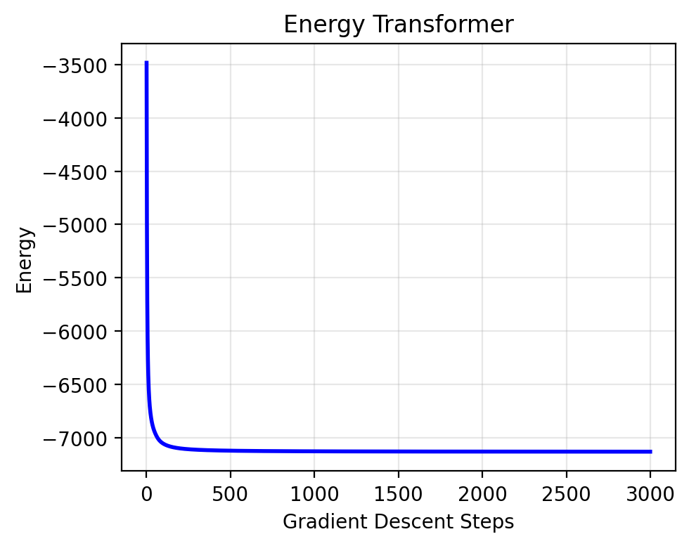

# Energy Transformer


<!-- WARNING: THIS FILE WAS AUTOGENERATED! DO NOT EDIT! -->

<style>
    .red { color:rgb(247, 109, 104); }
    .blue { color:rgb(64, 130, 200); }
    .green { color:rgb(89, 203, 78); }
    .yellow { color:rgb(252, 211, 28); }
</style>

## Transformers look like Dynamical Systems

> Squint, and the Transformer looks like a dynamical system.

At its core, the transformer is a stack of *L* transformer blocks that
takes a length *N* sequence of input tokens
{**x**<sub>1</sub><sup>(0)</sup>, …, **x**<sub>*N*</sub><sup>(0)</sup>}
and outputs a length *N* sequence of output tokens
{**x**<sub>1</sub><sup>(*L*)</sup>, …, **x**<sub>*N*</sub><sup>(*L*)</sup>}.
Each token **x**<sub>*i*</sub><sup>(*l*)</sup> ∈ ℝ<sup>*D*</sup> is a
vector of dimension *D*.

When blocks are stacked, the residual connections form a “residual
highway” that consists entirely of normalizations and additions from
`Attention` and `MLP` operations.


**Associative Memory** (AM) requires a global energy function, where
each computation minimizes the total energy of the system. Our goal is
to derive an energy function whose gradient looks as much like the
Transformer block as possible.

## The Energy of the Transformer Block

We will now build a kind of associative memory called the “Energy
Transformer” (Hoover et al. 2024) that turns the familiar transformer
operation into an energy minimization. Energy Transformer (ET) defines a
single energy on an **x** ∈ ℝ<sup>*N* × *D*</sup> collection of tokens,
where we can think of each token **x**<sub>*B*</sub> as a “particle”
that knows some information about itself and needs to figure out what it
should become. Some particles (unmasked tokens) already know their
identity, while others (masked tokens) only know their position and must
discover their identity by interacting with their neighbors.

Minimizing the energy of the Energy Transformer (ET) is a recurrent
process. The entire transformer consists of a single Transformer block,
and each “layer” of the transformer becomes a gradient descent step down
the energy. This gradient descent step looks remarkably like a standard
transformer block, complete with attention, MLP-like operations, layer
normalizations, and residual connections.

The global energy combines two intuitive ideas: (1) **attention energy**
that encourages masked tokens to align with relevant unmasked tokens,
and (2) **memory energy** that ensures all tokens look like realistic
patterns the model has learned. The gradient of each of these energies
look like a self-attention and MLP, respectively, with some shared
weight constraints.

This is one of those situations where the code ends up being
significantly simpler than the equations. We write the equations for
completeness, but feel free to skip to
<a href="#sec-ET-implementation" class="quarto-xref">Section 2.3</a> for
succinct code.

### Math of Attention Energy

We describe the energy of a multi-headed attention with *H* heads, where
the *h*-th head of attention is parameterized by
**W**<sub>*h*</sub><sup>*Q*</sup>, **W**<sub>*h*</sub><sup>*K*</sup> ∈ ℝ<sup>*D* × *Y*</sup>,
where *Y* is the “head dimension”. The input to the attention is the
normalized token vectors $\hat{\mathbf{x}} \in \mathbb{R}^{N \times D}$.
In the math that follows, we index the heads by *h* = 1…*H*, the head
dimension by *α* = 1…*Y*, tokens by *A*, *B*, *C* = 1…*N*, and each
token vector by *i*, *j* = 1…*D*.

<div>

> **Einstein notation**
>
> We find it convenient to use Einstein notation for the math, since it
> maps 1:1 to the einops operations we’ll use in the code. If you aren’t
> familiar with the notation, check out [this awesome
> tutorial](https://einops.rocks/1-einops-basics/). But fair warning,
> the equations at first look pretty complicated with all the indices.
>
> One tip for reading equations with lots of indices: *you don’t need to
> remember the shape or order of tensors*, just remember the meaning of
> the indices. The number of subscripts is the number of dimensions of
> the tensor, and the meaning of each dimension is captured in the index
> name. For example, let *B* = 1…*N* index the token position in a
> sequence, and let *i* = 1…*D* index into each token vector.
> *x*<sub>*B**i*</sub> is an element of a 2-dimensional tensor capturing
> the sequence length *N* and token dimension *D*. Transposes don’t have
> meaning since things are named, so
> *x*<sub>*B**i*</sub> = *x*<sub>*i**B*</sub>. So long as you know the
> index semantics, you can read always read the equation. Everything is
> just scalar multiplication and addition.

</div>

The familiar queries and keys are computed as normal linear
transformations:

$$ 
   \begin{split}
        K\_{h \alpha B} &= \sum\limits_j W^K\_{h \alpha j}\\ \hat{x}\_{Bj}, \qquad \mathbf{K} \in \mathbb{R}^{H \times Y \times N} \\
        Q\_{h \alpha C} &= \sum\limits_j W^Q\_{h \alpha j}\\ \hat{x}\_{Cj}, \qquad \mathbf{Q} \in \mathbb{R}^{H \times Y \times N}
    \end{split}
$$

Our familiar “raw attention scores” (pre-softmax) are still the
dot-product correlations between each query and key:

*A*<sub>*h**B**C*</sub> = ∑<sub>*α*</sub>*K*<sub>*h**α**B*</sub>*Q*<sub>*h**α**C*</sub>

Now for the different part: we describe the energy of the attention as
the negative log-sum-exp of the attention scores. We will use the *β* as
an inverse-temperature hyperparameter to scale the attention scores.

<span id="eq-attention-energy">
$$
E^\text{ATT} = -\frac{1}{\beta} \sum\_{h=1}^H \sum\_{C=1}^N \log \left( \sum\_{B \neq C} \exp(\beta A\_{hBC}) \right)
 \qquad(1)$$
</span>

As we saw in [a previous notebook](./00_dense_storage.ipynb), the
negative log-sum-exp is an exponential variation of the Dense
Associative Memory. The cool thing is that the gradient of the negative
log-sum-exp is the softmax, which is what we’d like to see in the
attention update rule.

<div>

> **Where are our values?**
>
> You may recall that traditional attention also has a value matrix.
> When we take the gradient of
> <a href="#eq-attention-energy" class="quarto-xref">Equation 1</a>, we
> lose the flexibility to include an independently parameterized values:
> the values **must** be a function of the queries and the keys.

</div>

### Memory Energy

In traditional transformers, the MLP (without biases) can be written as
a two-layer feedforward network with a ReLU on the hidden activations.
The MLP is parameterized by two weight matrices
**V**, **W** ∈ ℝ<sup>*M* × *D*</sup> where *M* is the size of the hidden
layer (*M* = 4*D* is often viewed as the default expansion factor atop
token dimension *D*). Let’s again use Einstein notation, where
*μ* = 1…*M* indexes the hidden units, *i*, *j* = 1…*D* index the token
dimensions, and *B* = 1…*N* indexes each token.

<span id="eq-mlp-update">
$$
\text{MLP}(\hat{\mathbf{x}})\_{Bi} = \sum\_\mu W\_{\mu i} \\ \text{ReLU}\left(\sum_j V\_{\mu j} \hat{\mathbf{x}}\_{Bj}\right)
 \qquad(2)$$
</span>

If we assume weight sharing between **V** = **W** = **ξ**, this is a
gradient descent step down the energy of a Hopfield Network

$$
E^{\text{HN}}(\hat{\mathbf{x}}) = - \sum\_{B, \mu} F\left(\sum_j \xi\_{\mu j} \hat{\mathbf{x}}\_{Bj}\right)
$$

with rectified quadratic energy
$F(\cdot) := \frac12 \text{ReLU}(\cdot)^2$. If we say
*f*(⋅) := *F*′(⋅) = ReLU(⋅), the negative gradient of the energy is

$$
-\frac{\partial E^{\text{HN}}(\mathbf{\hat{x}})}{\partial \hat{x}\_{Bi}} 
= \sum\_\mu \xi\_{\mu i} \\ f\left(\sum_j \xi\_{\mu j} \hat{\mathbf{x}}\_{Bj}\right),
$$

which is identical to the MLP operation in
<a href="#eq-mlp-update" class="quarto-xref">Equation 2</a> with a
weight sharing constraint.

<div>

> **Note**
>
> It is perfectly reasonable to consider other convex functions *F* for
> use in the energy. Polynomials of higher degree *n* or exponential
> functions are both valid and will yield [Dense Associative
> Memory](./00_dense_storage.ipynb). However, because traditional
> Transformers use a ReLU activation, we use a rectified quadratic
> energy.

</div>

### ET in code

Let’s implement the attention energy in code. We will use
[`jax`](https://github.com/jax-ml/jax) and
[`equinox`](https://github.com/patrick-kidger/equinox) for our code.

``` python
class EnergyAttention(eqx.Module):
  """Energy of multi-headed attention.
  
  Has only two learnable parameters, Wk and Wq"""
  Wq: Float[Array, "H D Y"] # Query projection
  Wk: Float[Array, "H D Y"] # Key projection
  beta: Optional[float] = None # inverse temperature

  def energy(
    self, 
    xhat:Float[Array, "N D"], # Layer normalized tokens
    ) -> float:
    "Attention energy's update rule is computed via autograd of this energy."
    beta = self.beta or 1/jnp.sqrt(self.Wk.shape[-1])
    K = jnp.einsum("kd,hdy->khy", xhat, self.Wk)
    Q = jnp.einsum("qd,hdy->qhy", xhat, self.Wq)
    A = jax.nn.logsumexp(beta * jnp.einsum("khy,qhy->hqk", Q, K), -1)
    return -1/beta * A.sum()

class HopfieldNetwork(eqx.Module):
  "A simple Hopfield Net with ReLU activation replaces the MLP"
  Xi: Float[Array, "M D"]

  def energy(self, xhat:Float[Array, "N D"]):
    """Return the Hopfield Network's energy"""
    hid = jnp.einsum("nd,md->nm", xhat, self.Xi)
    E = -0.5 * (hid.clip(0) ** 2).sum()
    return E
```

Note that we will restrict ourselves to using a **special layernorm**
that can be viewed as the gradient of a convex Lagrangian function.
We’ll just show this in code – it is the same as the standard layer
normalization, but we restrict the learnable `scale` parameter to be a
scalar, not a vector of shape `D`.

``` python
class EnergyLayerNorm(eqx.Module):
  """Define our primary activation function (modified LayerNorm) as a lagrangian with energy"""
  gamma: Float[Array, ""]  # Scaling scalar
  delta: Float[Array, "D"] # Bias per token
  use_bias: bool = False
  eps: float = 1e-5
    
  def lagrangian(self, x):
    """Integral of the standard LayerNorm"""
    D = x.shape[-1]
    xmeaned = x - x.mean(-1, keepdims=True)
    t1 = D * self.gamma * jnp.sqrt((1 / D * xmeaned**2).sum() + self.eps)
    if not self.use_bias: return t1
    t2 = (self.delta * x).sum()
    return t1 + t2

  def __call__(self, x):
    """LayerNorm. The derivative of the Lagrangian"""
    xmeaned = x - x.mean(-1, keepdims=True)
    v = self.gamma * (xmeaned) / jnp.sqrt((xmeaned**2).mean(-1, keepdims=True)+ self.eps)
    if self.use_bias: return v + self.delta
    return v
    
  def energy(self, x):
    """Compute the energy of this Lagrangian through the Legendre Transform"""
    return (self(x) * x).sum() - self.lagrangian(x)
```

That’s it! We rely on autograd to do the energy minimization. Let’s
check that the energies of both attention and memory monotonically
decreases and is bounded from below.

``` python
N, H, D, Y = 100, 12, 128, 42
M = 4*D # MLP size
key1, key2, key3, key4 = jr.split(jr.PRNGKey(11), 4)
eattn = EnergyAttention(Wq=jr.normal(key1, (H, D, Y))/Y, Wk=jr.normal(key2, (H, D, Y))/Y)
hn = HopfieldNetwork(Xi=jr.normal(key3, (M, D)))
lnorm = EnergyLayerNorm(gamma=1., delta=jnp.zeros(D))

def energy_recall(Efn, x_init, nsteps, step_size):
  "Simple gradient descent to recall a memory"
  @jax.jit
  def gd_step(xhat, i):
      energy, grad = jax.value_and_grad(Efn)(lnorm(xhat))
      xhat_next = xhat - step_size * grad
      return xhat_next, energy

  xhat_init = lnorm(x_init)
  final_xhat, energy_history = jax.lax.scan(
      gd_step,
      xhat_init,
      jnp.arange(nsteps)
  )
  return final_xhat, energy_history

x_init = lnorm(jr.normal(key4, (N, D))) # Layer normalized tokens
final_attn_xhat, attn_energy_history = energy_recall(eattn.energy, x_init, nsteps=3000, step_size=0.5)
final_hn_xhat, hn_energy_history = energy_recall(hn.energy, x_init, nsteps=3000, step_size=0.5)
```



### Total energy

The total energy of the ET block is the sum of the attention energy and
the memory energy.

$$
E^\text{ET}(\hat{\mathbf{x}}) = E^\text{ATT}(\hat{\mathbf{x}}) + E^\text{HN}(\hat{\mathbf{x}})
$$

−∇*E*<sup>ET</sup>(**x**) has all four components of the standard
transformer block, albeit with some weight sharing and the `MLP+Attn`
operations happening in parallel rather than sequentially.

The sum of two bounded energies is, of course, also bounded.

``` python
def total_energy(xhat): 
  return eattn.energy(xhat) + hn.energy(xhat)

key1, key2 = jr.split(jr.PRNGKey(14), 2)
xhat_init = lnorm(jr.normal(key2, (N, D))) # Layer normalized tokens
final_xhat, energy_history = energy_recall(total_energy, xhat_init, nsteps=3000, step_size=0.5)
```

<figure>

<figcaption aria-hidden="true">Energy descent for ET’s total
energy.</figcaption>
</figure>

## Using a pretrained Energy Transformer

To make the Energy Transformer described above work on real data, we
need to add some necessary addendums to work with image data, i.e.,
trained embeddings, position matrices, and code to patch the image.

ET has publicly available pretrained weights that can be used for
masked-image inpainting. Let’s load those weights into our model.

## Training an Energy Transformer

We train ET on a simple dataset, should work on CPU.

The Transformer is a very flexible computing paradigm that can be used
for the two major approaches of modern language modeling: **masked token
prediction** (e.g., BERT and diffusion-style transformers) where you
predict the fraction of input tokens that are MASKed using information
from the unmasked tokens, and **autoregressive language modeling**
(e.g., GPT-style models), where each token in the input sequence is
transformed into the next prediction token.

<div id="refs" class="references csl-bib-body hanging-indent"
entry-spacing="0">

<div id="ref-hoover2024energy" class="csl-entry">

Hoover, Benjamin, Yuchen Liang, Bao Pham, Rameswar Panda, Hendrik
Strobelt, Duen Horng Chau, Mohammed Zaki, and Dmitry Krotov. 2024.
“Energy Transformer.” *Advances in Neural Information Processing
Systems* 36.
<https://proceedings.neurips.cc/paper_files/paper/2023/file/57a9b97477b67936298489e3c1417b0a-Paper-Conference.pdf>.

</div>

</div>
